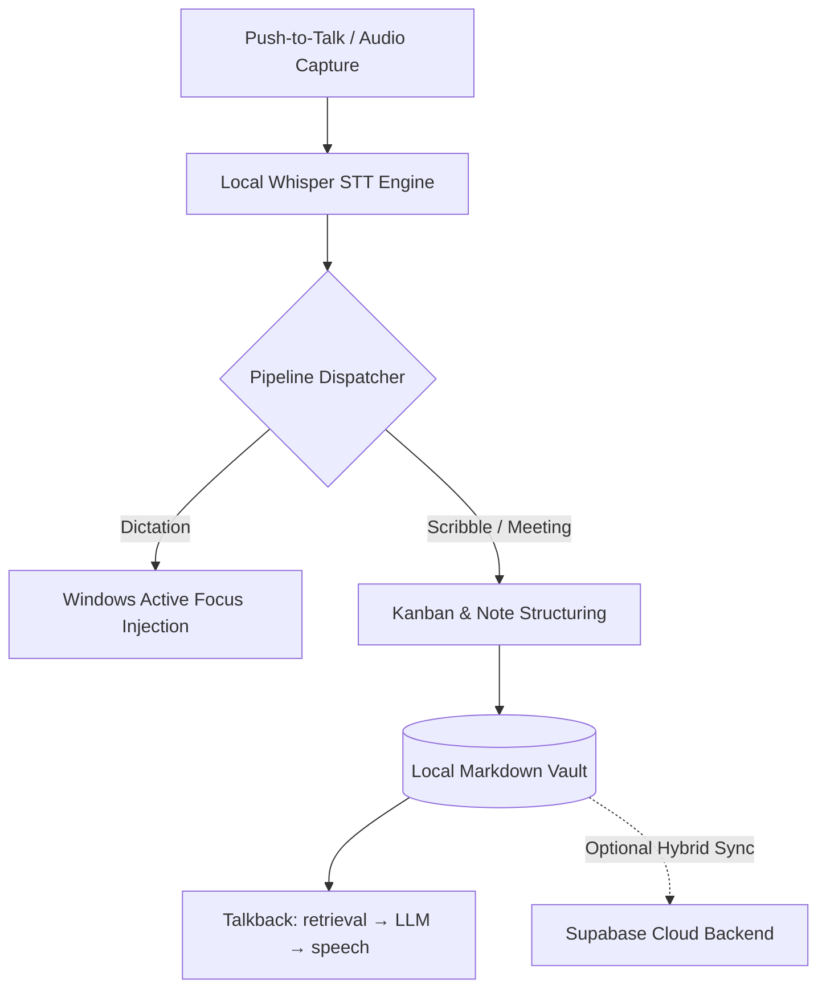

# Relay _(relay-workspace)_

> Hybrid (local-first + cloud) AI voice and memory assistant for Windows — turns push-to-talk speech into structured Kanban cards, markdown notes, and direct dictation without cloud lock-in.

[](https://github.com/Nitinsudarshan/Relay/actions/workflows/ci.yml)
[](LICENSE)

> [!NOTE]
> **Status: Pre-Alpha / Active Development**  
> Relay is under active development and is not yet recommended for production use.

## Why Relay

Traditional dictation tools stream raw audio to third-party clouds and leave you with walls of transcript text that require manual re-reading and manual copying.

Relay processes speech locally using Whisper and structured pipelines to instantly convert spoken thoughts into organized Kanban tasks, meeting agendas, and grounded vault notes while keeping all audio and notes strictly on your machine.

## Features

- **Universal Dictation** — Transcribes push-to-talk audio and injects text directly into whatever Windows app or field has active focus.
- **Meeting Intelligence** — Records mic and system audio into durable 30-second chunks with live transcription, then derives a summary, decisions and the reasoning behind them, owned action items, risks, open questions, topics, and speakers from the transcript. Your own notes, typed during or after the meeting, are read as an extra source and never rewritten. Summary length adapts to the meeting rather than a fixed cap, and generated prose is validated before it is shown. The raw speech-to-text output is kept immutable as the diagnostic source, and any meeting can become a Scribble that references it.
- **Scribble Pipeline** — Parses rough voice scribbles into structured Kanban task cards and vault notes.
- **Talkback** — A conversational agent over everything Relay has captured. Ask out loud what you decided, what you said, or what happened in a meeting; answers about your own history come only from your Voice Notes, Scribbles and Meetings, with the sources shown. Speak over it to interrupt, and turn a conversation into a Voice Note or a Scribble by saying so. Its voice runs locally: `Settings › Talkback › Make Relay speak` downloads, verifies and self-tests the speech engine in one click.
- **Local Vault Storage** — Saves audio recordings, transcripts, and structured entities locally as Markdown files with YAML frontmatter.
- **Hybrid Cloud Sync** — Optional Next.js + Supabase web dashboard for cross-device visibility and team synchronization when enabled.

## Requirements

- **Node.js**: `20+`
- **Rust**: `1.75+` (for native Tauri desktop backend)
- **OS**: Windows 10/11 (with WebView2 runtime)

## Install

```bash
npm run install:all
```

<details>
<summary><b>Individual surface installation</b></summary>

```bash
# Native desktop app
cd native && npm install

# Web dashboard
cd web && npm install
```

</details>

## Quick start

Run the native desktop application in development mode:

```bash
npm run dev:native
```

To run the Next.js hybrid web dashboard:

```bash
npm run dev:web
```

## How it works



## Tests

```bash
# Rust backend — 714 tests (+3 ignored benchmarks)
cd native/src-tauri && cargo clippy --all-targets -- -D warnings && cargo test

# Native frontend — 117 tests
cd native && npm test && npm run typecheck

# Web dashboard — typecheck and build
cd web && npx tsc --noEmit && npm run build
```

CI runs all of these on every push and pull request
([`.github/workflows/ci.yml`](.github/workflows/ci.yml)). See
[`docs/testing.md`](docs/testing.md) for what is covered and what is not.

Building the Rust crate needs a C/C++ toolchain and CMake for whisper.cpp. On
Linux it also needs the GTK/WebKit and ALSA development headers — the CI
workflow's `system dependencies` step is the authoritative list.

## Contributing

Contributions are welcome — please read [`AGENTS.md`](AGENTS.md) for coding conventions and repository rules before opening a pull request, and [`docs/README.md`](docs/README.md) for the documentation map.

## License

Relay is licensed under the GNU Affero General Public License v3.0.
See [LICENSE](LICENSE) for the complete license text.

