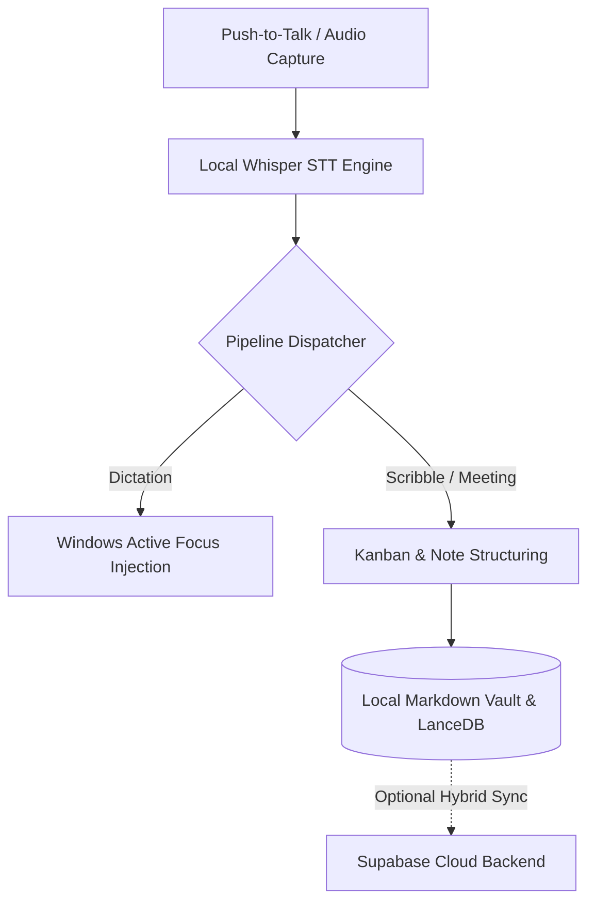

# Relay _(relay-workspace)_

> Hybrid (local-first + cloud) AI voice and memory assistant for Windows — turns push-to-talk speech into structured Kanban cards, markdown notes, and direct dictation without cloud lock-in.

[](LICENSE)

> [!NOTE]
> **Status: Pre-Alpha / Active Development**  
> Relay is under active development and is not yet recommended for production use.

## Why Relay

Traditional dictation tools stream raw audio to third-party clouds and leave you with walls of transcript text that require manual re-reading and manual copying.

Relay processes speech locally using Whisper and structured pipelines to instantly convert spoken thoughts into organized Kanban tasks, meeting agendas, and grounded vault notes while keeping all audio and notes strictly on your machine.

## Features

- **Universal Dictation** — Transcribes push-to-talk audio and injects text directly into whatever Windows app or field has active focus.
- **Meeting & Scribble Pipelines** — Automatically parses live meeting audio and rough voice scribbles into structured Kanban task cards.
- **Local Vault Storage** — Saves audio recordings, transcripts, and structured entities locally in Markdown files and LanceDB vector store.
- **Ground-in-Vault Voice Chat** — Answers user questions in real-time, strictly grounded in your local markdown vault notes.
- **Hybrid Cloud Sync** — Optional Next.js + Supabase web dashboard for cross-device visibility and team synchronization when enabled.

## Requirements

- **Node.js**: `20+`
- **Rust**: `1.75+` (for native Tauri desktop backend)
- **OS**: Windows 10/11 (with WebView2 runtime)

## Install

```bash
npm run install:all
```

<details>
<summary><b>Individual surface installation</b></summary>

```bash
# Native desktop app
cd native && npm install

# Web dashboard
cd web && npm install
```

</details>

## Quick start

Run the native desktop application in development mode:

```bash
npm run dev:native
```

To run the Next.js hybrid web dashboard:

```bash
npm run dev:web
```

## How it works



## Contributing

Contributions are welcome — please read [`AGENTS.md`](AGENTS.md) for coding conventions and repository rules before opening a pull request.

## License

Relay is licensed under the GNU Affero General Public License v3.0.
See [LICENSE](LICENSE) for the complete license text.

